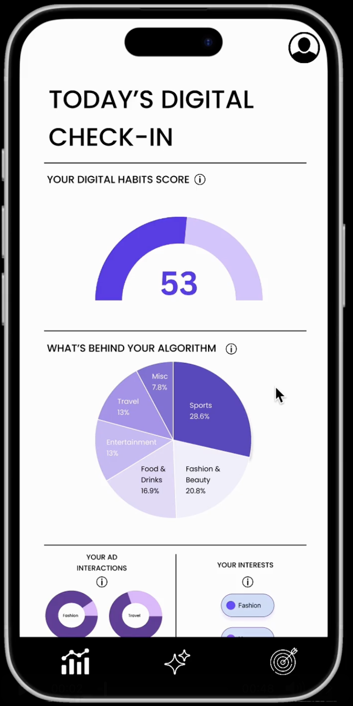
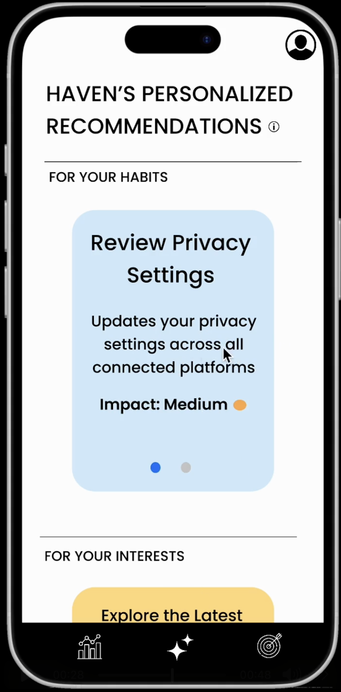
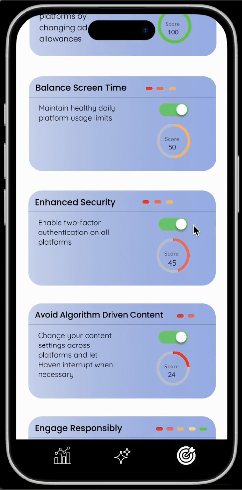

  
  <h1 align="center">Haven: An AI-Powered Digital Wellness App</h1>
  

    A privacy-first mobile application to help users understand and reclaim their digital footprint.
  

  

    <strong>My Role: Co-Founder & Founding Engineer</strong>
  

  
  

---

### ⚠️ Confidential & Proprietary Project

Due to the commercial nature of this startup and the proprietary algorithms involved, the source code for this repository is not public. This showcase is intended to detail the project's architecture, impact, and my specific contributions as a technical leader.

---

### 🎯 The Problem

Users today have limited visibility and control over how their personal data is used by large tech platforms like Google and Meta. This lack of transparency can lead to social media addiction and a diminished sense of digital wellbeing, without clear, actionable ways for individuals to improve their habits.

### ✨ Our Solution

Haven is a privacy-first mobile application that empowers users to take back control. By ingesting and analyzing user-exported data from Google and Meta, Haven reverse-engineers engagement patterns and surfaces powerful, personalized insights. The app was built to help users understand their own digital addiction patterns and provide recommendations to foster healthier online habits. We successfully onboarded and gathered feedback from **300 alpha users** during our initial testing phase.

---

### 👨‍💻 My Contributions as Co-Founder & Founding Engineer

As the technical co-founder, I owned the full product lifecycle—from architectural design to deployment, QA, and user growth. Key contributions:

- **Full-Stack Mobile Development:**  
  Built and scaled a cross-platform privacy app in **Flutter** with a serverless **Firebase backend (Firestore, Auth, Storage)** on **GCP**, securely handling **300+ early users** and load-tested to support **5,000+ concurrent sessions with <200ms latency**.

- **AI-Powered Analytics Optimization:**  
  Optimized an **LLM analytics pipeline** across **3 OpenAI models** using **Redis caching** and **async queues**, cutting redundant API calls and **reducing cloud costs by 37%** while improving throughput and reliability.

- **Team Leadership & CI/CD Automation:**  
  Led end-to-end development with **CI/CD pipelines, QA, and code reviews**, mentoring a **3-person engineering team** and accelerating feature release cycles by **30%**.  

- **Recognition & Impact:**  
  Haven was recognized as a **Top 3 finalist out of 150+ teams** at **NYU Stern’s 2025 Entrepreneur Challenge** and featured in *Entrepreneur Magazine*.  

---

### 🛠️ Technology Stack

| Category            | Technologies                                                                                                                                                                                                                                                        |
| ------------------- | ------------------------------------------------------------------------------------------------------------------------------------------------------------------------------------------------------------------------------------------------------------------- |
| **📱 Mobile App** |                                                                         |
| **☁️ Cloud & Backend** |                                                      |
| **🤖 AI & Machine Learning** |    |
| **Databases** |                                                 |

## 📱 App Screenshots

  
  
  
  

